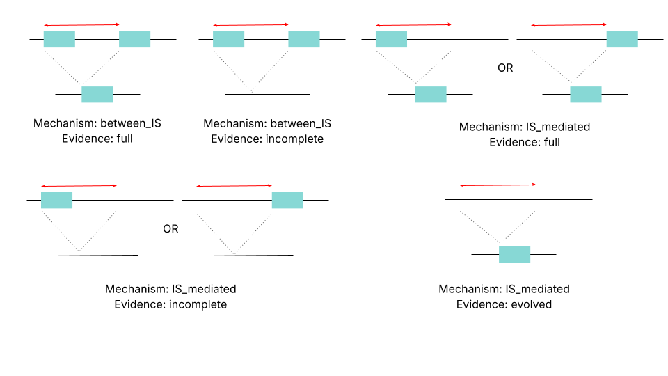
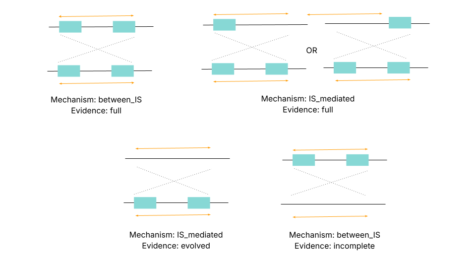

# Output

## Analyse genome sizes

This command generates `data/04_rename_genome/genome_size_stats.csv` as output. This csv file has the following fields:

- assembly: name of the assembly, as specified in `data/data.csv`
- ancestor: name of the ancestor, as specified in `data/data.csv`
- size_assembly: size of the assembly, in bp
- size_ancestor: size of the ancestor, in bp
- difference: size_assembly - size_ancestor. This value is negative when the ancestor is larger than the assembly
- percent_change: the difference in size, as a percent of the size of the assembly 

See a sample table in the [tutorial](tutorial.md).

## Predict SVs

[mummer4](https://github.com/mummer4/mummer) is used to perform alignments between assembly-ancestor pairs. The alignment files are stored in `data/06_nucmer_alignment/<assembly>/` directories. Each of these directories contains the following files:

- `<assembly>.delta`: The all-vs-all alignment generated by the `nucmer` command of _mummer4_ 
- `<assembly>.delta.filter`: The `<assembly>.delta` file is filtered by the `delta-filter` command to only retain alignments > 95% sequence identity and > 100bp long.
- `<assembly>.filtered.coords`: A file summarising information about each delta alignment in the filtered file.

For specific information about these file formats, please refer to the [mummer manual](https://mummer.sourceforge.net/manual/#coords). 

Next [SyRI](https://github.com/schneebergerlab/syri) is used to call SVs using those alignments. The output files for each assembly is in the respective `data/07_syri_output/<assembly>/` directories. Each of these directories contains the following files:

- `<assembly>syri.out`: a tsv file that describes the location and type of SVs in the assembly, relative to its ancestor. We refer the user to the official [SyRI documentation](https://schneebergerlab.github.io/syri/fileformat.html) for information on interpreting this table. You may notice that the reference and query chromosome ID  read as "genome". This is because SyRI attempts to call variants between homologous chromosomes, and hence expects the reference and query ID to be the same string. To prevent this error from occurring, the genomes are renamed to a placeholder string 'genome'. You may also see that for a deletion, the query start and stop site are the same. You can also find a sample table in the [tutorial](tutorial.md). 
- `<assembly>syri.vcf`: a variant calling format (vcf) file describing the same SVs

Raw output generated by [SyRI](https://github.com/schneebergerlab/syri) was refined with custom python scripts to predict a minimal set of structural variants. Briefly, new insertions of individual IS elements due to transposition events were filtered out, ambiguous nomenclature for deletions was replaced with consistent terminology, falsely classified duplications were corrected, adjacent deletions were merged, and adjacent syntenic regions were merged. This filtered set of SVs is a tsv file `data/07_syri_output/<assembly>/<assembly>_clean.syri.out` and follows the same file format as `<assembly>syri.out`. 

Finally, a modified version of [plotsr](https://github.com/ira-zibbu/plotsr) is used to generate synteny plots. Two synteny plots are generated in `data/07_syri_output/<assembly>/`:

- `<assembly>.plot.pdf`: synteny plot corresponding to the SVs in `<assembly>syri.out`
- `<assembly>.plot.2.pdf`: synteny plot corresponding to SVs in `<assembly>_clean.syri.out`

> Tip: The 4th and 5th columns of the `<assembly>_clean.syri.out` file have the reference/query sequences for indels. For large deletions, these field can have thousands of bases. To view this tsv file in the terminal without these columns, try running

```
cat <assembly>_clean.syri.out | cut --complement -f 4-5
```

Note: SyRI sometimes fails to correctly identify copy number variation (deletions and amplifications) or more complex rearrangements (such as overlapping inversions).

## Annotate genes in SVs

This command uses [prokka](https://github.com/tseemann/prokka) annotate genes in the assemblies and combines insertion sequence ore and generates GFF files for each in `data/09_annotated_genomes/<assembly>/<assembly>.gff`.

Next, [breseq](https://github.com/barricklab/breseq) uses these GFF files to annotate the genes present in the deletions, inversions and amplifications. This step produces two outputs for each assembly:

- `data/12_genome_diff_tables/gd/<assembly>.gd`: This is a GenomeDiff format that is a tsv file describing the locations, size and types of SVs. Please see the [breseq](https://gensoft.pasteur.fr/docs/breseq/0.35.0/gd_format.html) documentation for more information about this file format. 
- `data/12_genome_diff_tables/html/<assembly>.html`: This is an html, human-readable version of the GenomeDiff file that contains the names of the genes contained in the SV regions. For an example of this table, please see the [tutorial](tutorial.md). For information about the columns in this table, please see the [breseq](https://gensoft.pasteur.fr/docs/breseq/0.35.0/output.html#html-human-readable-output) documentation. 

## Predict SV mechanism

This command annotates the insertion sequences at the boundaries of structural variants (for deletions and inversions only) and predicts putative mechanisms. All of the output from this step is in the directory `data/11_annotated_boundaries/`. Each assembly has three files associated with it:

-  `data/11_annotated_boundaries/<assembly>_boundaries.csv`: This csv file annotates insertion sequences that are within a threshold distance of the start and end sites of a structural variant. The threshold has arbitrarily been set to 20bp. This csv file has the following columns. Note: For deletions, the `query_start` and `query_stop` coordinates will be of the same length. Additionally, the distances can be positive or negative, depending on if the insertion sequence starts/ends before or after that edge of the SV.

	- `ref_start`: Start site of the SV in the ancestor
	- `ref_stop`: Stop site of the SV in the ancestor
	- `query_start`: Start site of the SV in the assembly
	- `query_stop`: Stop site of the SV in the aseembly
	- `tag_3`: Type of SV. This follows the [SyRI](https://schneebergerlab.github.io/syri/fileformat.html) nomenclature (SYN: syntenic region, INV: inversion, DUP: duplication, TRANS: translocation, DEL: deletion)
	- `L_ref`: Name of insertion sequence within threshold distance of the start site of the SV in the ancestor. This is 'NA' if none is found.
	- `L_ref_distance`: Distance of the closest end of the insertion sequence from the start site of the SV in the ancestor.
	- `R_ref`:  Name of insertion sequence within threshold distance of the stop site of the SV in the ancestor. This is 'NA' if none is found.
	- `R_ref_distance`: Distance of the closest end of the insertion sequence from the start site of the SV in the ancestor.
	- `L_query`:  Name of insertion sequence within threshold distance of the start site of the SV in the assembly. This is 'NA' if none is found.
	- `L_query_distance`: Distance of the closest end of the insertion sequence from the start site of the SV in the assembly.
	- `R_query`: Name of insertion sequence within threshold distance of the stop site of the SV in the assembly. This is 'NA' if none is found.
	- `R_query_distance`: Distance of the closest end of the insertion sequence from the start site of the SV in the assembly.

- `data/11_annotated_boundaries/<assembly>_deletion.csv`: This file contains the same fields as above, with two additional columns. These columns describe the various configurations in which insertion sequences can flank a deletion.

	- `Mechanism`: This field can take on values of 'between_IS' (when a deletion occurs between two IS elements that were already present in the ancestor), 'IS_mediated' (when only one or none of the implicated IS elements were present in the ancestor) and 'other' (through recombination between other repeats or illegitimate recombination)
	- `Evidence`: This field can take on values of 'full', 'evolved', 'incomplete' or 'NA'. 

The following image describes the different configurations in which insertion sequences can be present around a deletion, and the mechanism and evidence that is assigned on that basis. The red arrow depicts the region that was deleted, and the blue boxes indicate insertion sequences.



- `data/11_annotated_boundaries/<assembly>_inversion.csv`: This file describes the various configurations in which insertion sequences can flank an inversion. It contains the same columns as the above file.

The following image describes the different configurations in which insertion sequences can be present around an inversion, and the mechanism and evidence that is assigned on that basis. The orange arrow depicts the region that was inverted, and the blue boxes indicate insertion sequences.



Additionally, this command generates two summary files: `data/11_annotated_boundaries/deletion_mechanism.csv` and `data/11_annotated_boundaries/inversion_mechanism.csv`. They contain information about the mechanism of deletions and inversions respectively, for all of the assemblies. Both these files have the same fields:

- `clone`: name of the assembly
- `total`: total number of inversions or deletions
- `between_IS`: number of inversions or deletions that whose mechanism was 'between_IS'
- `IS_mediated`: number of inversions or deletions that whose mechanism was 'IS_mediated'
- `other`: number of inversions or deletions whose mechanism was through recombination between other repeats or illegitimate recombination

For examples of all of these tables, please see the [tutorial](tutorial.md). 