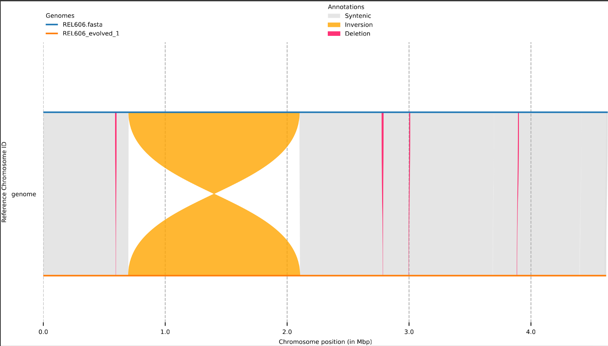
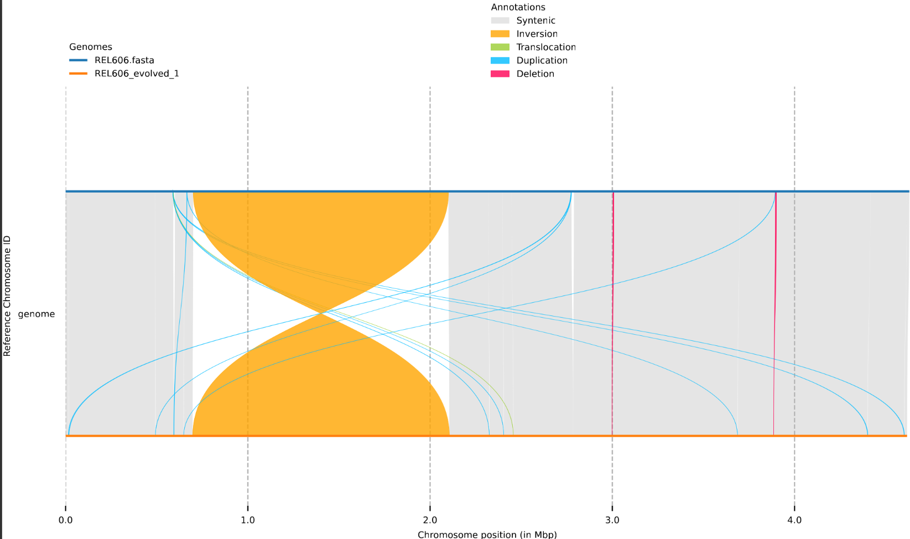
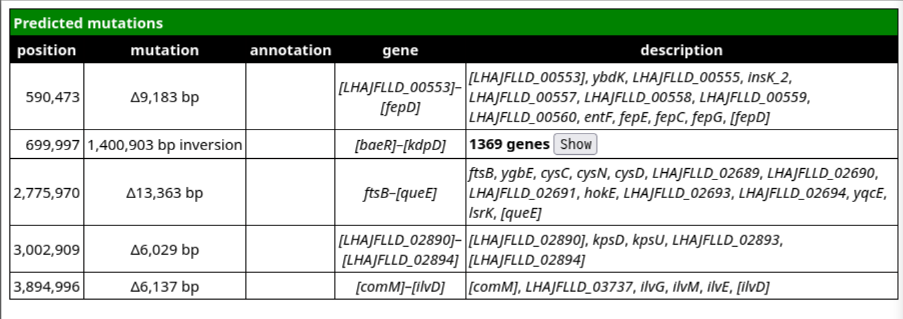

# Tutorial 

This is a tutorial with example data for _seabreeze_. Please [install the software, create the conda enviroment and activate it](installation.md ) first. 

To get started, navigate to the root of the _seabreeze_ directory, and copy the `example/` directory:
```
cp -r example/ data/
```

The newly created `data/` folder should look like this:
```
|---data/
|   |
|   |---data.csv
|   |---ori_dif_sequences.csv
|   |---02_genomes/
|   |   |
|   |   |---REL606_evolved_1.fasta
|   |   |---REL606_evolved_2.fasta
|   |   |---REL606.fasta
```

For this tutorial, structural variant mutations have been simulated on the *E. coli* strain REL606 genome using _breseq_. These mutated genome assemblies are `REL606_evolved_1.fasta` and `REL606_evolved_2.fasta`. We aim to identify the structural variants in these assemblies relative to their ancestor, `REL606.fasta`. These pairwise comparisons to be performed are specified in a csv file called `data.csv` in the `data/` directory.  For more information about the valid format of this file, please see the [usage](usage.md) page.

To view this csv file:
```
cat data/data.csv
```

It should look like this:

| assembly         | ancestor |     |
| ---------------- | -------- | --- |
| REL606           | REL606   |     |
| REL606_evolved_1 | REL606   |     |
| REL606_evolved_2 | REL606   |     |

We include a comparison of `REL606` to itself as a quality check step, as we do not expect any mutations when a genome is compared to itself.

All of the following commands should be run from the _seabreeze_ root directory. Here, 4 cores have been allocated to run _seabreeze_ but this number can be higher on lower depending on your hardware.
## Analyse genome sizes

This command compares the sizes of the assemblies to their specified ancestors in a pairwise manner. 

```
snakemake --use-conda --cores 4 analyse_genome_sizes
```

The output file generated is `data/04_rename_genome/genome_size_stats.csv`. Please see [output](output.md) for more information about the fields in this table. This table should look this this:

| assembly         | ancestor | size_assembly | size_ancestor | difference | percent_change |
| ---------------- | -------- | ------------- | ------------- | ---------- | -------------- |
| REL606           | REL606   | 4629812       | 4629812       | 0          | 0.0            |
| REL606_evolved_1 | REL606   | 4617111       | 4629812       | -12701     | -0.2743        |
| REL606_evolved_2 | REL606   | 4549910       | 4629812       | -79902     | -1.7258        |

As we expected, there is no size difference when `REL606` is compared to itself. We can see that both of the assemblies `REL606_evolved_1` and `REL606_evolved_2` are smaller than the ancestor.

## Find insertion sequences

This command uses [ISEscan](https://github.com/xiezhq/ISEScan/blob/master/README.md?plain=1) to annotate partial and full-length IS elements in the genomes. 
```
snakemake --use-conda --cores 4 predict_IS_elements
```

All of the output generated is stored in `data/05_isescan_tables/`. This tutorial should generate the following files in this directory:

```
|---data/
|   |---05_isescan_tables/
|   |   |
|   |   |---REL606.csv
|   |   |---REL606_evolved_1.csv
|   |   |---REL606_evolved_2.csv
|   |   |---REL606/
|   |   |---REL606_evolved_1/
|   |   |---REL606_evolved_2/
```
Each assembly has a .csv file that describes the locations of IS elements in that genome, and a directory where the additionally files generated by _ISEScan_ are made. For information about interpreting this csv file, we refer users to the official [ISEScan documentation](https://github.com/xiezhq/ISEScan/blob/master/README.md).

## Predict SVs

This command aligns the assembly-ancestor pairs, predicts structural variants and generates synteny plots. 

```
snakemake --use-conda --cores 4 predict_structural_variants
```

This will generate the following directories:
```
|---data/
|   |---06_nucmer_alignment/
|   |   |
|   |   |---REL606/
|   |   |---REL606_evolved_1/
|   |   |---REL606_evolved_2/
|   |   |
|   |---07_syri_output/
|   |   |
|   |   |---REL606/
|   |   |---REL606_evolved_1/
|   |   |---REL606_evolved_2/
```

We are primarily interested in a table describing the SVs and the synteny plot. This command also generates other files that may be useful, but are not required. Please see [output](output.md) for information about those files.

Let's look at the SVs for `REL606_evolved_1`
```
cd data/07_syri_output/REL606_evolved_1
cat REL606_evolved_1_clean.syri.out | cut --complement -f 4-5
```

This command prints the tsv file `REL606_evolved_1_clean.syri.out` to the terminal, while hiding the 4th and 5th columns. These columns show the reference/query sequences for indels, and hence can be quite large.

```
genome	1	    590471	genome	1	    595344	SYN1	-	SYN	-
genome	590473	599656	genome	595344	595344	DEL	-	DEL	-
genome	599657	700001	genome	595345	697137	SYN5	-	SYN	-
genome	699997	2100900	genome	697133	2105267	INV15	-	INV	-
genome	2100896	2775884	genome	2105263	2784492	SYN7	-	SYN	-
genome	2775970	2789333	genome	2784492	2784492	DEL	-	DEL	-
genome	2789334	3697156	genome	2784487	3686254	SYN11	-	SYN	-
genome	3002909	3008938	genome	2998062	2998062	DEL6	SYN11	DEL	-
genome	3697154	4415713	genome	3687698	4400119	SYN12	-	SYN	-
genome	3894996	3901133	genome	3885540	3885540	DEL7	SYN12	DEL	-
genome	4415710	4629812	genome	4401562	4617111	SYN13	-	SYN	-
genome	4615673	4629812	genome	4602972	4617111	SYN14	-	SYN	-

```
We refer the user to the official [SyRI documentation](https://schneebergerlab.github.io/syri/fileformat.html) for information on interpreting this table. You may notice that the reference and query chromosome ID may read as "genome". This is because SyRI attempts to call variants between homologous chromosomes, and hence expects the reference and query ID to be the same string. To prevent this error from occurring, the genomes are renamed to a placeholder string 'genome'. 

Let us view the synteny plot  `REL606_evolved_1.plot.2.pdf` in this same directory. It can be opened with any application that allows you to view a PDF. 



The ancestor genome is the blue line, and the orange line is the evolved genome REL606_evolved_1. The grey ribbons show syntenic regions. We can see that there was one large inversion (in yellow) and several smaller deletions across the genome (in red).

One of the steps that _seabreeze_ performs is to remove false positive SV calls and misassigned SVs. As an example of what this synteny plot looks like before this processing, we can view the plot `REL606_evolved_1.plot.pdf` 



Two deletions (~0.5Mb and ~2.8Mb) were not correctly called. There also appear to be many small "duplications". These correspond to spurious alignments between the many copies of IS elements, and do not always represent bona fide instances of structural variant mutations. It should also be noted that _seabreeze_ does not track IS transposition events.

## Annotate genes in SVs

To annotate the genes present in the deletions, inversions and amplifications, run this command:

```
snakemake --use-conda --cores 4 annotate_SV_regions
```

The primary output generated by this command are a series of html files in 

```
|---data/
|   |---12_genome_diff_tables
|   |   |---html
|   |   |   |---REL606.html
|   |   |   |---REL606_evolved_1.html
|   |   |   |---REL606_evolved_2.html
```

Let us look at `REL606_evolved_1.html` as an example. This file can be opened by your web browser application.
 

This table describes the mutations, their type, location and the genes present in them. For more information on this table, please see [breseq documentation](https://gensoft.pasteur.fr/docs/breseq/0.35.0/output.html#html-human-readable-output). 

## Predict SV mechanism

